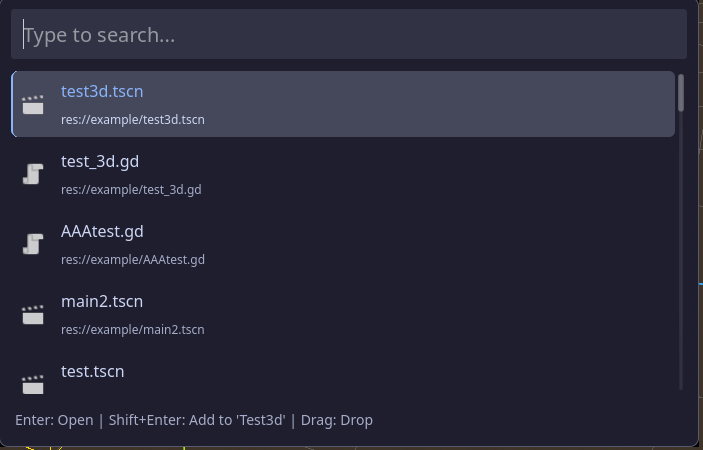
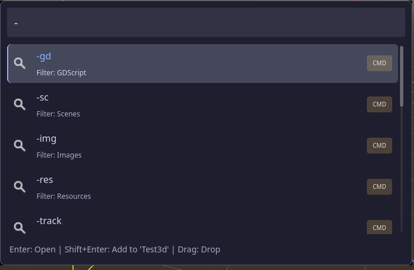

# Spotlight Search (Godot 4 Editor Plugin)

Directory: `addons/spotlight_search`

Spotlight Search is a "global search + command palette" plugin for Godot 4, offering capabilities such as file/scene/script search, command filtering, node jumping, history, Pinning, context menus, extended commands, and more, similar to Spotlight / Command Palette in IDEs.

---

## Demo

---

## Core Features

*   **Universal Search**: Quickly find scenes (`.tscn`), scripts (`.gd/.cs`), resources, images, and more.
*   **Command Palette**: Execute editor commands (e.g., New Script, Reload Project, Toggle Fullscreen) directly from the search bar.
*   **Node Tracking**: Tag frequently used nodes in the scene and locate them instantly using the `-track` command.
*   **History & Favorites**: Automatically records usage history and supports Pinning/Favoriting common files or commands.
*   **Context Menu**: Provides utility actions like Copy Path, Show in FileSystem, Copy Node Path, etc.
*   **Highly Extensible**: Support for custom extensions via JSON and GDScript to create your own workflows.

---

## Shortcuts & Key Bindings

Mastering these shortcuts is the key to maximizing your efficiency with Spotlight Search.

### Basic Actions
| Key | Action | Description |
| :--- | :--- | :--- |
| **Alt + Q** | **Open/Close Window** | Default activation shortcut (customizable in settings). |
| **Esc** | **Close Window / Menu** | Closes the context menu if open; otherwise defaults to closing the search window. |
| **↑ / ↓** | **Select Result** | Navigate up and down through the search results list. |
| **Enter** | **Execute / Open** | Open the selected file or execute the selected command. |
| **Tab** | **Autocomplete** | Fill the search bar with the text of the currently selected item. |

### Advanced Actions
| Key | Action | Description |
| :--- | :--- | :--- |
| **Shift + ↑** | **Show History** | **Only works when input is empty**. Displays recent commands and favorites. |
| **Alt + F** | **Toggle Favorite** | Add or remove the currently selected command from "Favorites". |
| **Shift + →** | **Open Context Menu** | Logic equivalent to Right-Click. Opens the action menu for the selected item. |
| **Shift + Enter** | **Execute (Shift Mode)** | Executes the command with alternative behavior (e.g., keep window open), depending on implementation. |

---

## Common Command Prefixes

Type these prefixes in the search bar to filter results or switch modes:

*   **Resource Filters**
    *   `-gd`: Search scripts only
    *   `-sc`: Search scenes only
    *   `-img`: Search images only
*   **Common Commands**
    *   `-new`: Create resources (Script, Shader, etc.)
    *   `-scene`: Current scene actions (Run, Save, Reload)
    *   `-quit`: Quit Editor
    *   `-reload`: Reload Project
    *   `-fs`: Toggle Fullscreen
*   **Advanced**
    *   `-config`: Open Plugin Settings
    *   `-track`: Search tracked nodes

---

## Installation

1.  Download this repository.
2.  Copy the `addons/spotlight_search` folder to your Godot project's root directory.
3.  Open the Godot Editor, go to **Project -> Project Settings -> Plugins**.
4.  Check **Enable** next to `Spotlight Search`.
5.  Once enabled, you will see a Spotlight button in the top toolbar, or press `Alt + Q` to start using it.

## 🔧 Configuration & Extensions

*   **Settings**: Type `-config` or click the Spotlight button in the toolbar to open Settings. You can adjust max results, exclude folder rules, and shortcut keys.
*   **Extensions**: The plugin supports a JSON-based extension system. You can write your own workflow actions in the `toolkit_extensions` folder. Check "Create Example Extension" in the settings window for a quick start.

---
*Made with ❤️ for Godot Developers.*

