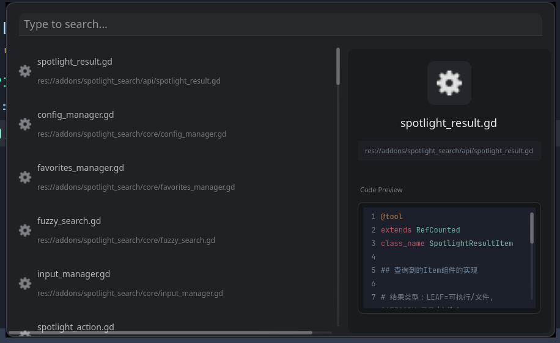
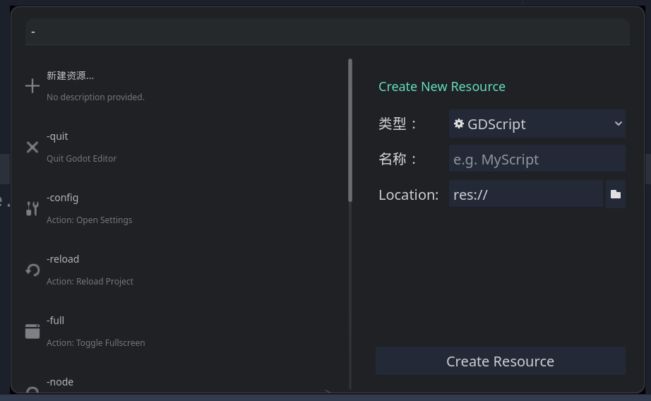

# Spotlight Search（Godot 4 编辑器插件）

目录：`addons/spotlight_search`

Spotlight Search 是一个面向 Godot 4 的"全局搜索 + 命令面板"插件，提供文件/场景/脚本搜索、命令过滤、节点跳转、历史记录、Pin 固定、上下文菜单、扩展命令等能力，类似 IDE 中的 Spotlight / Command Palette。

---

## 演示

---

## 核心功能

*   **全能搜索**：快速查找场景 (`.tscn`)、脚本 (`.gd/.cs`)、资源、图片等文件。
*   **命令面板**：不仅是搜索，还能执行编辑器命令（如新建脚本、重载项目、切换全屏等）。
*   **节点追踪**：标记场景中的常用节点，随时通过 `-track` 命令快速定位。
*   **历史记录与收藏**：自动记录使用习惯，支持将常用命令或文件 Pin 在顶部。
*   **上下文菜单**：提供复制路径、在文件系统中显示、复制节点路径等实用操作。
*   **高度可扩展**：支持通过 JSON 或 GDScript 编写自定义扩展命令。

---

## 快捷键与按键操作指南 (Key Bindings)

这是本插件的核心交互方式，掌握这些快捷键将通过大幅提升您的效率。

### 基础操作
| 按键 | 作用 | 说明 |
| :--- | :--- | :--- |
| **Alt + Q** | **打开/关闭搜索窗口** | 默认激活快捷键（可在配置中修改）。 |
| **Esc** | **关闭窗口 / 后退** | 如果有上下文菜单打开则优先关闭菜单，否则关闭搜索窗，或从子菜单返回上一级。 |
| **↑ / ↓** | **选择结果** | 在搜索结果列表中上下移动选中项。 |
| **Enter (回车)** | **执行 / 打开** | 打开选中的文件，或执行选中的命令。 |
| **Tab** | **自动补全 / 进入** | 将当前选中项的文本填入搜索框，或进入子级菜单。 |
| **→ (右箭头)** | **展开预览面板** | 强制打开右侧预览/详情面板。 |
| **← (左箭头)** | **折叠预览面板** | 强制关闭右侧预览/详情面板。 |

### 进阶操作
| 按键 | 作用 | 说明 |
| :--- | :--- | :--- |
| **Shift + ↓** | **显示收藏夹** | 显示所有收藏的命令或文件。 |
| **Shift + ↑** | **切换收藏状态** | 将当前选中的命令加入或移出“收藏夹”（Favorites）。 |

---

## 常用命令前缀

在搜索框输入以下前缀开启特定模式：

*   **资源过滤**
    *   `-gd`：仅搜索脚本
    *   `-sc`：仅搜索场景
    *   `-img`：仅搜索图片
*   **常用指令**
    *   `-new`：新建资源（脚本、Shader等）
    *   `-scene`：当前场景操作（运行、保存、重载）
    *   `-quit`：退出编辑器
    *   `-reload`：重载项目
    *   `-fs`：切换全屏
*   **高级功能**
    *   `-config`：打开插件设置
    *   `-track`：搜索已追踪的节点

---

## 安装方法

1.  下载本项目。
2.  将 `addons/spotlight_search` 文件夹复制到您的 Godot 项目根目录。
3.  打开 Godot 编辑器，进入 **Project (项目) -> Project Settings (项目设置) -> Plugins (插件)**。
4.  勾选 Enable (启用) `Spotlight Search`。
5.  启用后，您会在编辑器顶部看到 Spotlight 按钮，或直接按 `Alt + Q` 开始使用。

## 配置与扩展

*   **设置**：输入 `-config` 或点击顶部 Spotlight 按钮打开设置，可调整最大结果数、排除文件夹规则及快捷键。
*   **扩展**：插件支持 JSON 格式的扩展系统，您可以在 `toolkit_extensions` 文件夹下编写自己的工作流动作。详情参考配置窗口中的 "Create Example Extension"。

---
*Made with ❤️ for Godot Developers.*
